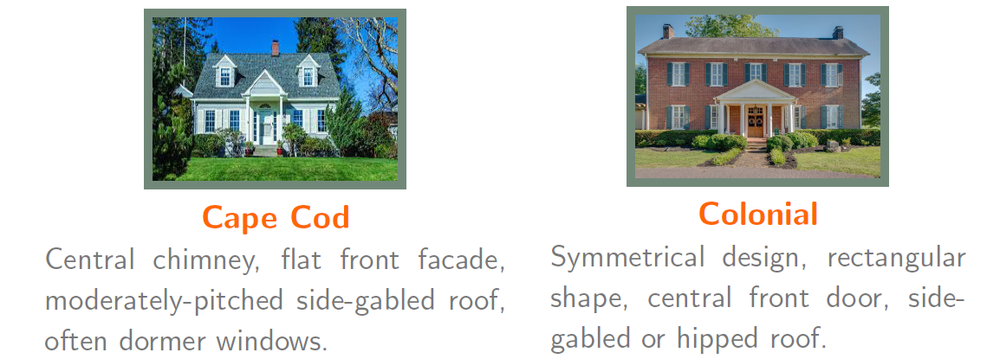
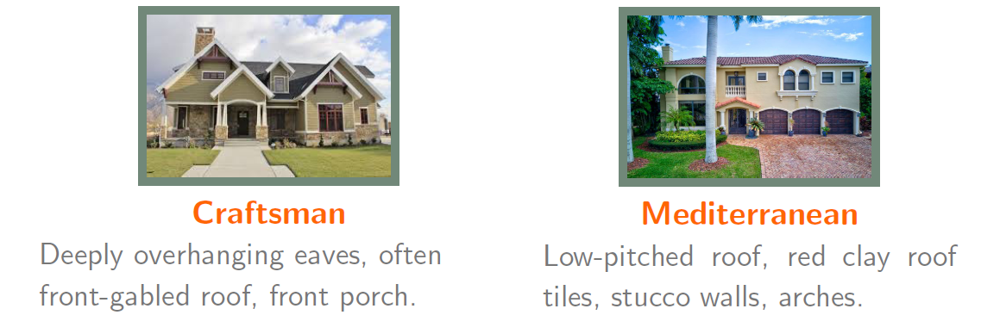

# HouseClassifier
---

For a quick summary of the project, see these
[slides](slides.pdf).

### What is HouseClassifier?
---

A 
[web app](http://www.houseclassifier.com) 
that classifies a given image of a house into one of six types,
'Cape Cod', 'Colonial', 'Craftsman', 'Mediterranean', 'Ranch', and 'Tudor'.

### How to use HouseClassifier?
---

To ascertain the type of a house, upload it's image using the 'Browse' button, 
and click 'Classify House'. The model will determine the most likely house 
type, and show you the predicted probabilities of all six classes.

### How does HouseClassifier work?
---

Behind HouseClassifier is a convolutional neural network model. The image you
submit is accepted and sent to the model using
[jQuery](http://jquery.com)
and 
[PHP](http://www.php.net).
The model then processes the image and returns a prediction. The model is 
deployed on an 
[AWS](http://aws.amazon.com)
(Amazon Web Service) EC2 (Elastic Compute Cloud) t3a.small instance using the 
[Flask](http://palletsprojects.com/p/flask)
framework. 

### What are the defining characteristics of the six types of houses?
---

### How was the model built, and what is included in this repository?
---

The model uses a pretrained 
[Xception](http://www.tensorflow.org/api_docs/python/tf/keras/applications/Xception)
model as a base model, and was trained on a dataset consisting of 2,100 images, 
with each of the six classes containing approximately 350 images. The goal of 
the model is to classify a given house image into one of six types, 'Cape Cod', 
'Colonial', 'Craftsman', 'Mediterranean', 'Ranch', and 'Tudor'.

The work was completed in the following two Jupyter Notebooks, both
included in this repository.

1. **Gathering and processing the images:**
The primary purpose of this notebook is to prepare a dataset on which to train
a convolutional neural network.
    - House images are downloaded using Google search and the Chrome extension 
`Download All Images.` Each image is manually inspected, and mislabeled and 
fake images are deleted. Additional images are downloaded from 
[zillow](http://www.zillow.com).
    - Duplicate images are removed. 
    - Training, validation, and test sets are prepared.

2. **Building and training a convolutional neural network:**
The primary purpose of this notebook is to build a model that can classify a 
given house image.
    - The dataset is balanced, so 'accuracy' is an appropriate evaluation 
metric.
    - As a first attempt, a basic convolutional neural network is built and
trained. Since the training dataset is rather small, the model includes a 
data augmentation layer. Unsurprisingly, the model does not perform well,
achieving an accuracy score of only 0.33
    - A better model is built using the technique of *Transfer Learning*.
A pretrained 
[Xception](http://www.tensorflow.org/api_docs/python/tf/keras/applications/Xception)
model is used as a base model.
    - The Xception model was developed for the 
[*ImageNet Large Scale Visual Recognition Challenge*](http://www.image-net.org/challenges/LSVRC),
and trained on a dataset consisting of more than a million images.
The pretrained model classifies a input image into one of 1000 diverse 
[categories](http://image-net.org/challenges/LSVRC/2017/browse-synsets), 
such as sea lion and tractor.
    - The base model is customized in two ways:
      * **Feature Extraction:** Representations learned by the base model is 
used to extract meaningful features from the house images.
      * **Fine-Tuning:** Some of the top layers of the pretrained base model 
are unfreezed, and jointly trained along with a new classifier.
    - The final model achieved an accuracy score of 0.93 on the test set
    - This notebook was run on an AWS EC2 c5a.9xlarge instance.

**Main tools and packages used for the project:** 
[Jupyter Notebook](http://jupyter.org), 
[NumPy](http://numpy.org), 
[pandas](http://pandas.pydata.org), 
[Matplotlib](http://matplotlib.org), 
[seaborn](http://seaborn.pydata.org), 
[scikit-learn](http://scikit-learn.org),
[TensorFlow](http://www.tensorflow.org),
[Keras](http://keras.io),
[Flask](http://palletsprojects.com/p/flask),
[jQuery](http://jquery.com), 
and 
[PHP](http://www.php.net).
